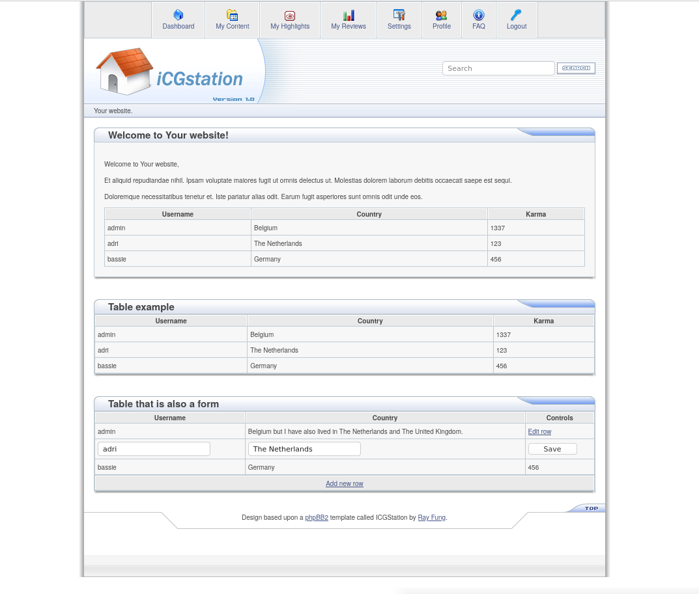
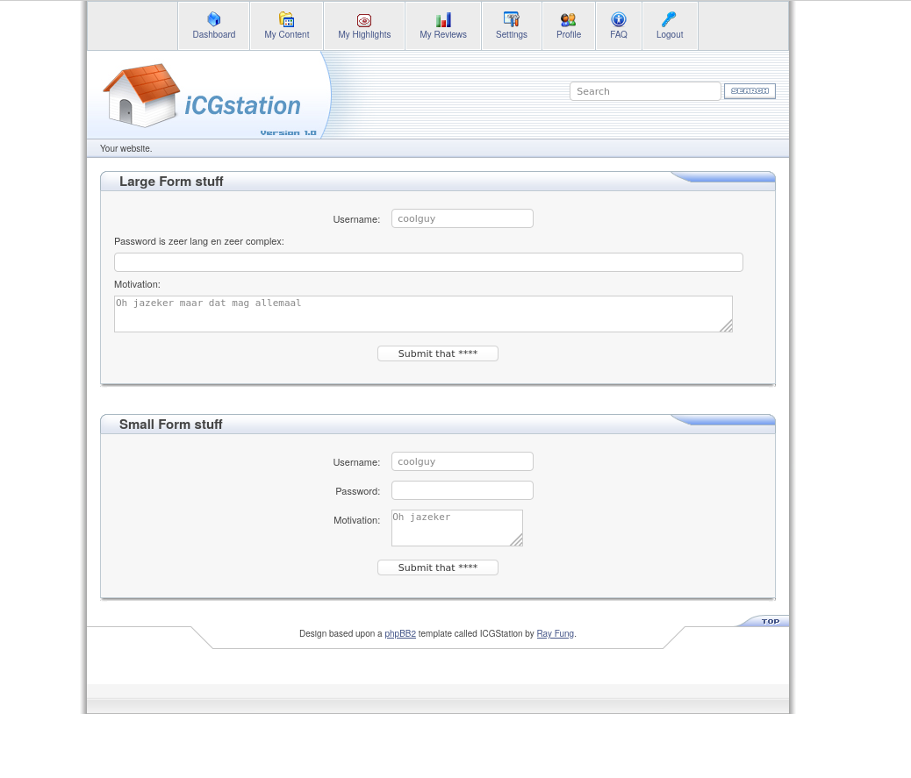
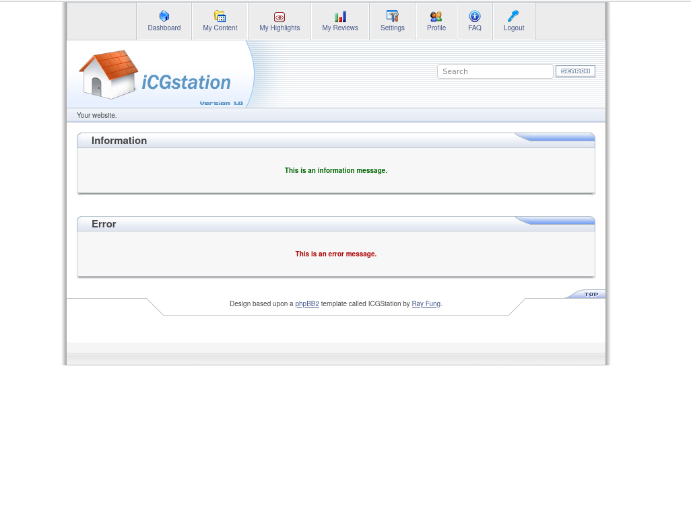

# ICGStation HTML/CSS template

A template that was used on [phpBB2](https://www.phpbb.com) forums in the early 2000's and of which I have good memories :)
This is a reimplementation of the phpBB2 template as a more modern (read no tables for layout) website template. It's not a forum template.
If you want the phpBB3 template, find a separate implementation by Ezcom [here](https://www.ezcom-fr.com/viewtopic.php?f=23&t=206).
I used their implementation to get the original images back but apart from that my HTML/CSS implementation is totally my own.

## Screenshots

## License

You are allowed to use it for any project you want, modify it to your liking, do whatever :)

